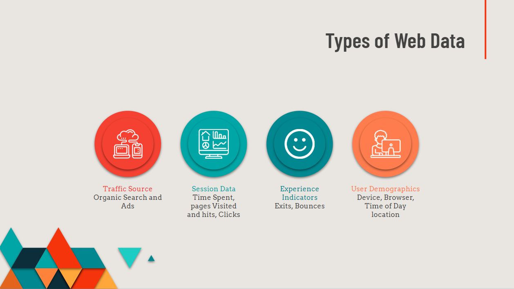
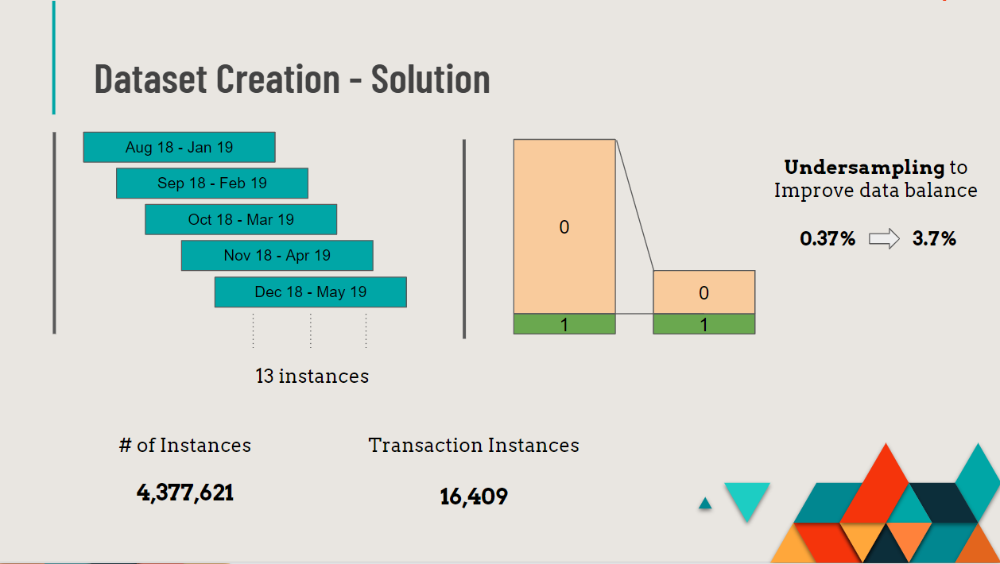
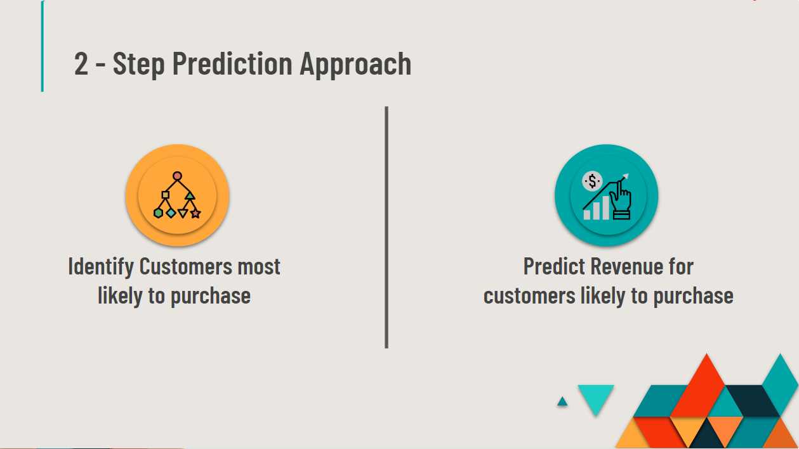
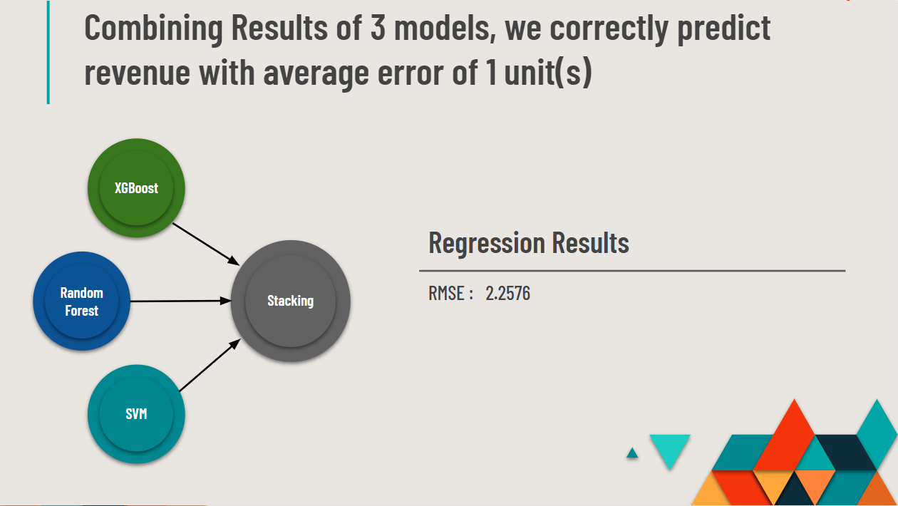
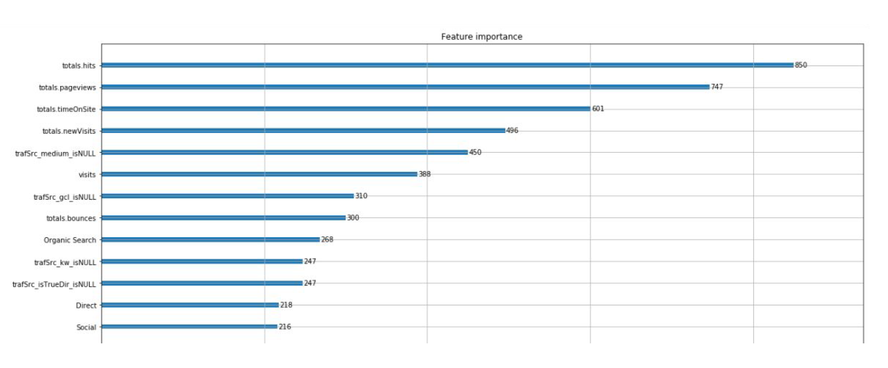

# Kaggle: Google Customer Revenue Prediction

[Kaggle Link](https://www.kaggle.com/c/ga-customer-revenue-prediction)

## Project Definition & Introduction

### Background & Context

Google runs a merchandise where they sell Google branded goods. The store is also known as GStore. The task for the Kaggle competition is to analyze customer dataset from a GStore to predict revenue per customer. This prediction can help managers to Identify potential customers and Market to them and also plan for store inventory management for improving in-store customer experience.

### Problem Statement

The 80/20 rule has proven true for many businesses–only a small percentage of customers produce most of the revenue. As such, marketing teams are challenged to make appropriate investments in promotional strategies. In the real world, this translates to a lot of potential marketing investment not yielding the inten ded return in revenue.

Given the tools and techniques in data analysis, our task is to generate actionable operational changes and provide insights that can be used to dedicate marketing budgets more effectively not just for GStore, but also for those companies that wish to use data analysis on top of GA data.

### Key Question

Can a predictive model prove useful to GStore for closely estimating revenue generated by visitors over a certain period of time? These estimations can be used for inventory management to balance demand and supply, future planning and also by the marketing team to design promotional strategies to target people at appropriate times.

### Solution Overview

The final solution is a two step approach in which we first use a classification model and a stacked regression model to identify as well as predict customer revenue.
We first predict customer’s tendency to make a purchase in the store. We first want to know what leads to a customer completing a purchase on the store before we try to estimate how much he purchases. 

For this we try to maximize the recall score of the model so that we capture all possible purchases. Next, we use this prediction as an indicator for predicting the revenue for these customers. We filter only the customers who have made a purchase from the first prediction and predict revenue for those customers only. This helps reduce the final error (rmse) and give out a better prediction.

Finally our goal for this prediction is to find important features, which can aid a manager in
finding potential customers who are likely to make a purchase. These customers can be
targeted and also, Store planning can be accordingly done for better customer experience.


## Data Mining

### Data Exploration




We are provided with 2 datasets, train and test with following sizes.
**train.csv - 24 GB**
**test.csv - 7 GB**
The prediction variable is the logarithmic revenue of the store visit, which is required at a customer level. Each row in the data represents a visit by a customer, and there are various attributes captures by google analytics for one visit.

The data fields in the given files with their data understanding are as below:

1. **fullVisitorId**- Unique Customer ID
2. **channelGrouping** - How User visited the store
3. **date** - The date on which the user visited the Store.
4. **device** - Details on how user accessed the website
5. **geoNetwork** - User Geographic details demographics data
6. **sessionId** - Unique ID for the session of the user
7.  **socialEngagementType** - "Socially Engaged" / "Not Socially Engaged".
8. **totals** - These contains various session attributes
9. **trafficSource** - Traffic Source of the section
10. **visitId** - An identifier for this visit
11. **visitNumber** - The session number for this user. If this is the first visit, then this is set to 1.
12. **visitStartTime** - The timestamp for the visit

The train data ranges from 1st August 2016 to 30th April 2018. And the test data is for 5.5 months ranging from 1st May 2019 to 15th October 2019.

Many data fields are also in Json format which first needs to be unpacked and flattened into columns, before analyzing and using the data.


### Data Cleaning

The imported data had following files in JSON format. We use the following function to flatten these files and convert them into required columns.

```python
JSON_COLUMNS = ['device', 'geoNetwork', 'totals', 'trafficSource']
for column in JSON_COLUMNS:
    column_as_df = json_normalize(df1[column])
    column_as_df.columns = [f"{column}.{subcolumn}" for subcolumn in
    column_as_df.columns]
    df1 = df1.drop(column, axis=1).merge(column_as_df, right_index=True,
    left_index=True, how = 'left')
```

These expanded fields give multiple columns which have no values in them and are zero. We neglect these columns and go ahead with columns which have further values in them for feature selection.


### Data Transformation

The data contains the fields at a visit level, and required prediction is at a customer level. We group the fields at a customer level to get the required aggregation. We group all numeric features at a customer level for the final dataset creation and encode all categorical variables into one-hot encoding.

For the categorical variables, we do not use all the available categories but only the ones which make sense. We select top 5 categories in each of the fields by frequency and club all other categories as ‘others’ to keep the dimensionality of the dataset small.


### Feature Selection

We select features from the data for analysis. Not all features are useful, and not all features have consistent values. We select the following features as per business understanding. 

We group the features into 4 distinct categories.

1. Web Traffic Data : Organic Search, Channel

2. Session Data : Hits, Visits, PageViews, Time spent on site, clicks

3. User Experience : Session Quality, Exits, Bounces, Hits, Bounces etc.

4. User Demographics : Geography, Time of the Day, Device, Browser etc.


After flattening nested JSON structures of the data, we generate 113 individual features in total. These data fields include channels via which the user came to the store, devices used to access the store, number of hits, page visits, time spent during each customer visit to the store and so on. The comprehensive data introduction can be found under Kaggle competition’s webpage: https://www.kaggle.com/c/ga-customer-revenue-prediction/data .

For evaluating which features to include, we explored values in each data column and made selection based on the predictive power of the features. For example, visitorID is a unique identifier for distinctions among customers, but it does not preserve any predictive power over the revenue a customer will spend. Similarly, the longitude and latitude of the geographic location during the visit is useful for data visualizations, but it does not add additional information for revenue prediction (since the city, the country are also presented in data fields). In addition, we discovered that there are 19 features that have constant values in the train set, so we decided to drop these features as they do not bring useful information and will slow down the modeling process.

After dropping consistent and unrelated features, we narrowed down the number of predictors to. A complete variables that we include in the model can be found in figure 1 in the appendix.


### Data Preparation - Rolling Window



As we needed to predict the revenue of customers in 5.5 months(provided in test data), we took 5.5 months of instances for each customers at different points of time. We were able to get three groups of time period to consider (August’16 - January’17), (February’17 - July’17), (August’17 - January’18). This approach gave us 1,052,414 number of rows, out of which 3,531 were with transactions. It was 0.34% of the total data. This showed us that the data was highly imbalanced and there were very few customers with transactions. To tackle this situation, we took a rolling window of 5.5 months.


| From         | To     |
| ------------ | ------ |
| August 16    | Jan17  |
| September 16 | Feb 17 |
| October16    | Mar 17 |
| November 16  | Apr 17 |
| Dec 16       | May 17 |
| Jan17        | Jun 17 |
| Feb 17       | Jul 17 |
| Mar 17       | Aug 17 |
| Apr 17       | Sep 17 |
| May 17       | Oct 17 |
| Jun 17       | Nov 17 |
| Jul 17       | Dec 17 |
| Aug 17       | Jan 18 |

This gave us 13 sets of datasets. Now we get 4,377,621 rows, out of which 16,409 were with transactions. After increasing no of instances with revenue, the data was too large to handle and run predictive models on to get results. So we under sampled the transactions without revenue. This helped us to get the data at a manageable level without losing any information on the instances with transactions. After under sampling we get 3.7% of customers with transactions.


### Challenges Faced

While using this data set we faced a few challenges. The first and foremost was dealing with the huge amount of data (31 GB). We used Google’s cloud services like Big Query, their high configuration instances and Storage. Secondly, the data was on transaction level, but we needed to provide customer level revenue, so we grouped the data into customer level. We figured that there are very few instances of transactions. For that, we used rolling period of transactions, this increased our instances with transactions. This method gave us a vast amount of data which we could not handle to run predictive algorithms on. We under sampled our non transactional instances.


## Analysis




### Model Evaluation

We Evaluate classification models on total recall score of the model. Since our data is highly imbalances, this is necessary to capture the maximum number of purchase instances as possible. For the regression problem, we use root mean squared error as the performance measure as this is a requirement for the competition.

### Exploring different Algorithms 

For algorithm selection, we break down the google prediction problem into two main issues based on the customers’ purchase status. One is the classification problem that whether the customers buy or not, and the other is the regression problem to predict the total revenue for those who are predicted to buy.

For the binary classification problem, we predict it with several mature algorithms, including XGBoost, Random Forest, Support Vector Classification and Logistic Regression. For each one, we use grid search to find the best parameters for the maximum accuracy

These algorithms give us a good performance on identifying customers’ purchase situations, whether they buy or not. From the results below, the accuracy of XGBoost Classification reaches up to 98.44%, which is the best among the four models. Besides, the reason why we choose XGBoost because it has built-in regularization, handles missing values well, and even tells us the importance of various features.

| Model               | Accuracy   | Recall     |
| ------------------- | ---------- | ---------- |
| XGBoost             | **99.41%** | **98.50%** |
| Random Forest       | 99.21%     | 94.58%     |
| SVM                 | 99.30%     | 95.23%     |
| Logistic Regression | 99.37%     | 93.71%     |

After classifying, we get a new column with the predicted values of Based on the new column, 0 or 1, we try a series of models for the regression problem, including Random Forest, SVR, ADABoost and XGBoost, to find the best models for stacking. So we import the following helpful packages from scikit-learn.

For each individual model, we set up various parameters and find the best versions of
regression models for parameter tuning using grid search in the Jupyter Lab.

Then we do the model evaluation with the metric Root Mean Square Error (RMSE), which shows that XGBoost Regressor fits the data best, and Random Forest and SVR follow it.

Meanwhile, ADABoost is a little overfitting with good performance in training dataset but works poorly in the testing dataset. Besides, we also tried Linear Regression and Linear Regression, which returned high RMSE and so they will not be involved into deeper discussion here.

| Model         | RMSE (Train) | RMSE(Test) |
| ------------- | ------------ | ---------- |
| ADABoost      | 1.326        | 1.370      |
| XGBoost       | **1.1115**   | **1.321**  |
| Random Forest | 1.167        | 1.376      |

### Stacking Models



Stacking is a way to ensemble multiple classification or regression models, to integrate the strength of decent models and make full use of them towards different parts of data. As the performance table shows before, one algorithm may not be enough to return pretty accurate and stable prediction results, and so we choose the top 3 models XGBoost, AdaBoost and Random Forest to try stacking and take the average RMSE from them.

From this, we could clearly see that the stacking model is not better than all the individual models, and has a higher RMSE than XGBoost, partly because the ADABoost and Random Forest are not decent enough and increase the total average RMSE. Therefore, we choose the XGBoost as the final model for regression and use it to predict the total revenue for customers.

All in all, we choose XGBoost for both classification and regression problem


## Business Insights

We trained the XGboost model on all players who we predict will make a purchase. We
generate a graph that represents the prediction power of all variables (35 of them) to how much these customers will spend. Below is the screenshot of top features:



According to the figure above, the top 4 important features are total hits, page views, time on site and new visitors. Hits and page views indicate how many hits and pages the buyer clicks or visits before a purchase, and we found out these customers on average clicks 34 times and visits 24 pages. These high-value operations may indicate that customers browse through websites and compare different products before making the purchase. However, it is also possible that the design of the website is not efficient enough so that customers need to visit more pages before finding their desired product and filling their purchase information. Hence, to enhance a better customer experience, we advise the website owner to check the structure of the website to see if there are any unnecessary websites.

Next, time spent, how much time the customers spend in browsing web pages, and the model shows that the potential customers will spend at least 20 minutes. The fourth attribute New Visitors indicates that whether the customer will make a purchase on their first visit. These customers could potentially have higher values to the store since they directly make purchase on their first visit. After these customers appear, the website can target them by providing them with promotions to increase their visit times.

In general, these models not only help to predict the total revenue on customer level but also reveals information about what metrics should the business owner pay attention to. By detecting these key features, we could generate information about customer behaviors and their willingness to make purchases in time. Then, the business owner could adopt a series of strategies to increase web traffic or conversion rate, including sending proper advertisement, giving relevant coupons and so on.